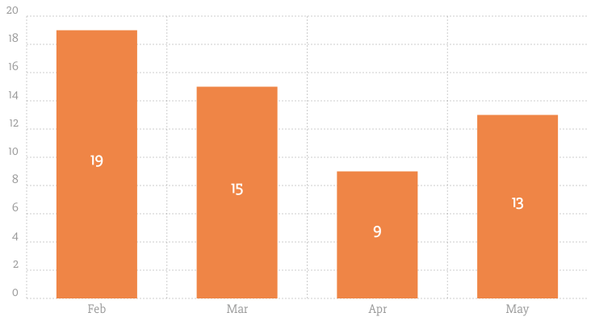
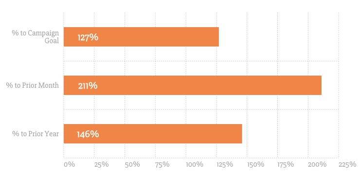

# Chartist Bar Labels Demo

A simple Chartist plugin to put labels on top of bar charts. Options are at the
bottom. This is a modification of the YorkshireInteractive bar labels plugin designed for use in webpack. Check out their project page at:
[YorkshireInteractive/chartist-bar-labels](https://github.com/YorkshireInteractive/chartist-bar-labels)

## Default usage

<div class="ct-chart"></div>

```js
var chart1 = new Chartist.Bar('.ct-chart', {
  labels: ['Feb', 'Mar', 'Apr', 'May'],
  series: [
    [19, 15, 9, 13]
  ],
  },{
  height: 400,
  axisY: {
    onlyInteger: true
  },
  plugins: [
    Chartist.plugins.ctBarLabels()
  ]
});
```
      

## Custom positioning and labeling usage

<div class="ct-chart-2"></div>

```js
var chart2 = new Chartist.Bar('.ct-chart-2', {
  labels: ['% to Campaign Goal', '% to Prior Month', '% to Prior Year'],
  series: [
    [127, 211, 146]
  ]
}, {
  chartPadding: {
    right: 50
  },
  height: 350,
  horizontalBars: true,
  reverseData: true,
  axisX: {
    labelInterpolationFnc: function(value) {
      return value + '%';
    },
    onlyInteger: true,
  },
  axisY: {
    offset: 135,
  },
  plugins: [
    Chartist.plugins.ctBarLabels({
      position: {
        x: function (data) {
          return data.x1 + 50
        }
      },
      labelOffset: {
        y: 7
      },
      labelInterpolationFnc: function (text) {
        return text + '%'
      }
    })
  ]
});
```

## Options

`labelClass` (default: `ct-bar-label`)

The class name so you can style the text


`labelInterpolationFnc` (default: `null`)

Use this to get the text of the data and you can return your own
formatted text. For example, for a percentage you could do this

```
Chartist.plugins.ctBarLabels({
 labelInterpolationFnc: function (text) { return text + '%' }
});
```

`labelOffset.x` (default: `0`) and `labelOffset.y` (default: `0`)

Depending on your font size you may need to tweak these. This will nudge the
labels by the amount of pixels given.

`position.x` (default: `null`) and `position.y` (default: `null`)

If labelOffset doesn't work for you and you need more custom positioning you
can use this. You can set position.x and position.y to functions and instead of
centering + labelOffset. This will _completely_ override the built in
positioning so labelOffset will no longer do anything. It will pass the bar
`data` back as the first param. Example:

```
Chartist.plugins.ctBarLabels({
  position: {
    x: function (data) {
      return data.x1 + 50; // align left with 50px of padding
    }
  }
});
```
